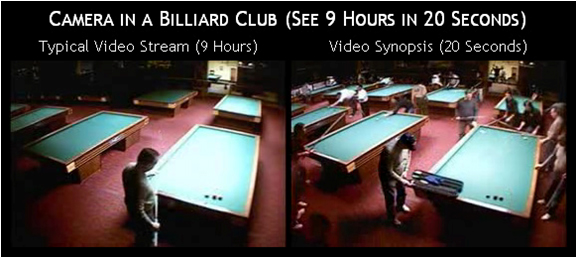
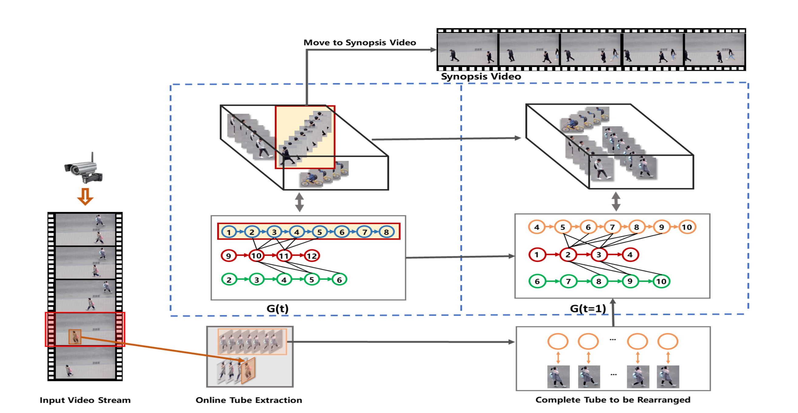
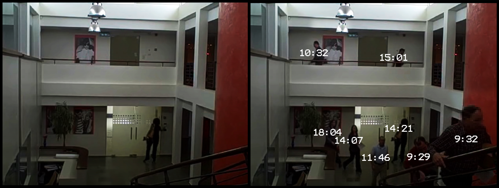

# Dynamic Graph Coloring Video Synopsis
A method using dynamic graph to solve the task of video synopsis
1. [Task Overview](#overview)
2. [Implementation Notes](#notes)

## 1. Task Overview
Video synopsis is a method for automatically synthesizing a short, informative summary of a video.

  

 Unlike traditional video summarization, the synopsis is not just composed of frames from the original video. The algorithm detects, tracks and analyzes moving objects (also called events) in a database of objects and activities.

  

The final output is a new, short video clip in which objects and activities that originally occurred at different times are displayed simultaneously, so as to convey information in the shortest possible time.
 

  

Video synopsis has specific applications in the field of video analytics and video surveillance where, despite technological advancements and increased growth in the deployment of CCTV (closed circuit television) cameras, viewing and analysis of recorded footage is still a costly labor-intensive and time-intensive task.

## 2. Implementation Notes

**This is my implementation:**

- It's mostly inspired by what I read from [this paper]("assets/papers/ruan_dynamic_graph_coloring.pdf") by Ruan et al and a few related ones. 
- I added a few small adjustments hoping it would work better with the data I’m using.
- I filled in the gaps with some guesswork and imagination — and yeah, it doesn’t really work well yet.  

---

**📅 Update Mar 2023**

I’ve got a full draft done, but there are still a couple of issues with coloring the graph and stitching the rearranged tubes into the final video.

- The color-picking logic isn’t solid yet, so the graph coloring isn’t working properly.  
- Also, the way the graph adjusts is a bit off — new tubes sometimes crash into ones already in the output list.

---

**✅ Update May 2023**

It *technically* works now, but the result isn’t as smooth as I was hoping.

There could be a few reasons for that:
- Maybe there’s a logic bug somewhere that I haven’t caught yet.
- Could also be because of the hyperparameter settings.
- And lastly, some interruptions in object extraction might be causing the tubes to be a bit choppy — you can see it in the [output video]("./assets/synopsis.avi") with glitches like flickering and ghosting.

---

